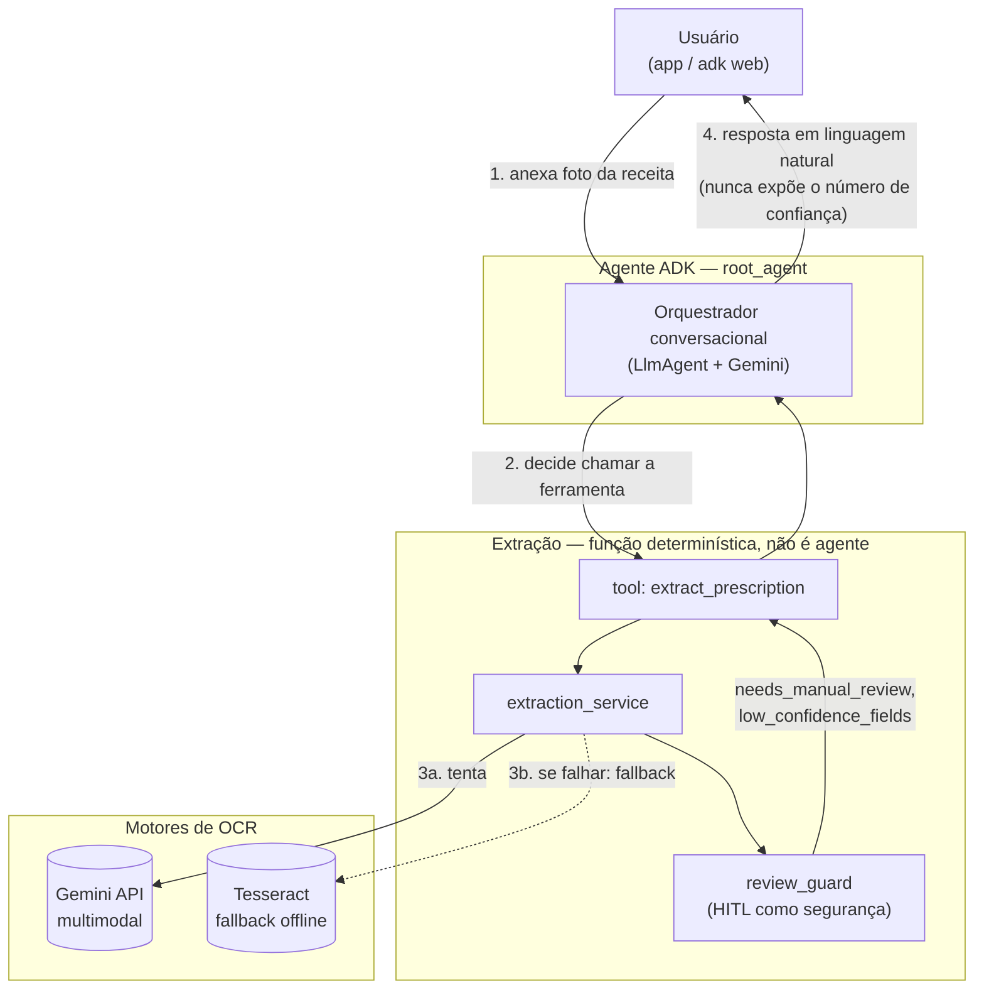

# Arquitetura — Agente OCR de Receitas (SAFEpass, Squad 44)

> Frente de IA do Desafio 04. Cobre RF03 (OCR), RF04 (card estruturado) e RF05
> (revisão manual) do módulo de histórico médico digital. Documento vivo — atualizar
> conforme o agente evoluir do protótipo pra produção.

## O que o agente faz

Recebe a foto de uma receita médica e devolve, direto, os dados estruturados:
**medicamento, dose, posologia e período**, com um sinal de confiança que decide se o
dado pode ser salvo automaticamente ou se precisa de revisão manual do usuário.

Em vez de OCR tradicional (Tesseract + regras, que erra muito com letra manuscrita e
fotos tortas), a leitura e a extração acontecem **num único passo**, usando a Gemini
API multimodal — ela lê a imagem e já devolve o JSON estruturado.

## Visão geral



## Por que essa arquitetura (decisões principais)

| Decisão | Por quê |
|---|---|
| **1 agente ADK só** (orquestrador), extração é uma **função**, não um 2º agente | A extração é uma chamada determinística de passo único (imagem entra, JSON sai) — um agente completo por trás seria complexidade sem ganho. Também evita um bug documentado do ADK (`AgentTool` descarta conteúdo multimodal do retorno). |
| **HITL em duas camadas**: no prompt (o modelo prefere declarar baixa confiança a "chutar") e como segurança (o guard não confia no self-report do modelo — força revisão se detectar texto suspeito ou confiança baixa) | Confiança "auto-declarada" pelo modelo não é confiável sozinha. A segurança tem que forçar a revisão, não só sugerir. |
| **Confiança nunca aparece pro usuário como número** | Comunicação em linguagem natural ("ficou claro" / "precisa confirmar") evita o usuário confiar cegamente num número que ele não sabe interpretar. |
| **Fallback offline via Tesseract** | Se a Gemini API falhar (sem rede, cota estourada), o sistema ainda entrega algo — texto bruto pra revisão manual — em vez de travar. Sem estruturação automática nesse caminho (arriscado sem um LLM validando). |
| **Rotação de chaves da Gemini API** | Desenvolvimento no tier gratuito do plano estudante — várias chaves em round-robin pra não estourar cota individual. Custo zero em dev; caminho de produção avaliado é a Claude API (~R$0,02–0,04/receita). |
| **Imagem via Artifact do ADK, não bytes crus no state** | Padrão recomendado pelos mantenedores do ADK pra mover binário entre callback e tool, evitando outro bug conhecido do framework. |

## Fluxo de decisão da extração

```mermaid
flowchart TD
    Start(["Foto da receita recebida"]) --> CallGemini["Chama Gemini API<br/>(imagem + prompt, response_schema)"]
    CallGemini -->|sucesso| Parse{"JSON estruturado<br/>válido?"}
    CallGemini -->|falha<br/>(rede/cota/erro)| Fallback["Fallback offline: Tesseract<br/>(texto bruto, sem estruturar)"]
    Parse -->|não| Fallback
    Parse -->|sim| Guard["review_guard.apply_hitl_guard"]
    Guard --> Injection{"Texto suspeito<br/>(prompt injection)?"}
    Injection -->|sim| ForceReview["Zera confiança do item<br/>needs_manual_review = true"]
    Injection -->|não| CheckConf{"confiança < limiar<br/>ou lista vazia?"}
    CheckConf -->|sim| ForceReview
    CheckConf -->|não| Approved["needs_manual_review = false<br/>(aprovado automaticamente)"]
    Fallback --> AlwaysReview["needs_manual_review = true<br/>(sempre, incondicional)"]
    ForceReview --> Respond(["Orquestrador responde ao usuário"])
    Approved --> Respond
    AlwaysReview --> Respond
```

## Requisitos funcionais cobertos

- **RF03** — OCR inteligente: leitura automática via Gemini multimodal.
- **RF04** — Card digital: dados saem já estruturados (medicamento/dose/posologia/período).
- **RF05** — Revisão manual: fallback obrigatório sempre que a confiança for baixa, houver
  suspeita de conteúdo malicioso na imagem, ou a leitura automática estiver indisponível.

## Stack desta frente

- **IA**: Google ADK (Agent Development Kit) + Gemini API (`google-genai`)
- **Fallback offline**: Tesseract OCR (`pytesseract`)
- **Linguagem**: Python
- **Validação de dados**: Pydantic (schemas de entrada/saída da extração)
- **Testes**: pytest (SDD + TDD — specs em `agents/specs/`, testes em `agents/tests/`)

## Documentação relacionada

- [`agents/README.md`](../agents/README.md) — detalhes técnicos, estrutura de pastas, como rodar.
- [`docs/CODEBASE_MAP.md`](CODEBASE_MAP.md) — mapa navegável do código, módulo a módulo.
- [`agents/specs/prescription-extraction.md`](../agents/specs/prescription-extraction.md) — spec com requisitos e critérios de aceite.
