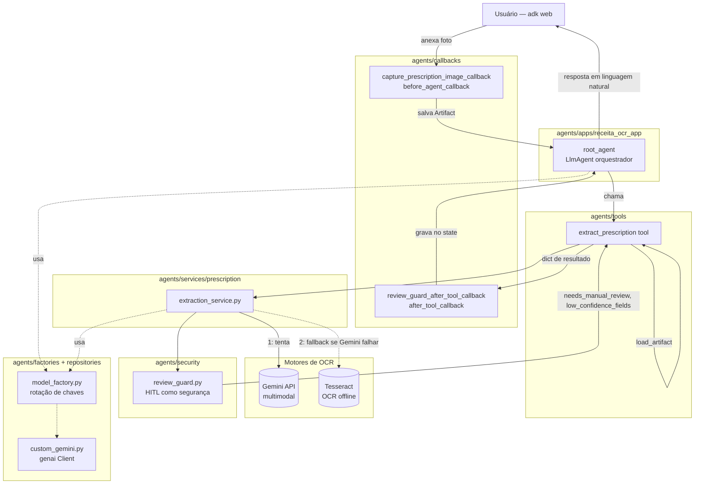
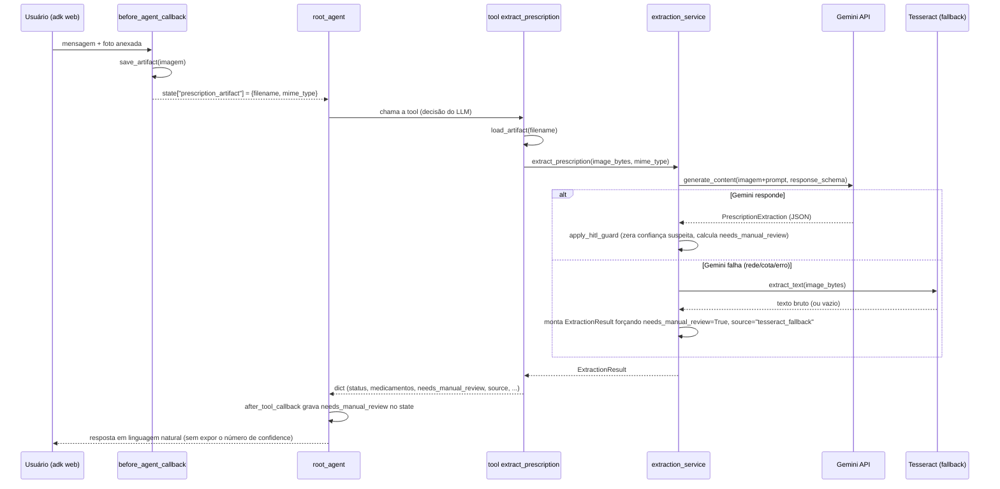

# Codebase Map

> Auto-generated by Cartographer. Last mapped: 2026-09-17T18:41:02Z

## System Overview

Este repositório é o protótipo do **SAFEpass — Squad 44, Desafio 04**. Hoje só a
pasta `agents/` tem conteúdo real: um agente ADK que lê fotos de receitas médicas via
Gemini multimodal e devolve dados estruturados, com fallback offline (Tesseract) e
revisão manual (HITL). As demais pastas de topo em `agents/` (`api`, `datasets`, `db`,
`utils`) existem como placeholders vazios para outras frentes do squad (API HTTP, dados,
banco) — não fazem parte deste mapa porque não têm conteúdo ainda.



## Directory Structure

```
prot_ocr/
├── .env                          # chaves (GOOGLE_API_KEY/GOOGLE_API_KEYS) — vazio, preencher localmente
├── README.md                     # vazio — reservado pra visão geral do projeto (outras frentes)
├── docs/
│   └── CODEBASE_MAP.md           # este arquivo
└── agents/                       # ÚNICA pasta com conteúdo real hoje — frente de IA
    ├── README.md                 # doc detalhada do agente (arquitetura, HITL, como rodar)
    ├── requirements.txt          # dependências Python do agente (runtime)
    ├── requirements-dev.txt      # + pytest, pra rodar a suíte de testes
    ├── pytest.ini                # pythonpath=. pra `from factories...` etc. resolverem
    ├── specs/                    # SDD — specs em Markdown (FR-N/AC-N/EC-N), _TEMPLATE.md pra novas
    ├── tests/                    # TDD — testes pytest, um arquivo por módulo testado
    ├── apps/
    │   └── receita_ocr_app/
    │       ├── agent.py          # root_agent (único agente ADK)
    │       └── runner.py         # helper de teste fora do `adk web`
    ├── tools/
    │   └── extract_prescription.py   # tool ADK chamada pelo orquestrador
    ├── services/prescription/
    │   └── extraction_service.py     # chamada Gemini + fallback Tesseract + schemas Pydantic
    ├── prompts/
    │   ├── orchestrator_prompt.py    # como o root_agent fala com o usuário
    │   └── extract_prescription_prompt.py  # instrução da chamada de extração (não fala com usuário)
    ├── security/
    │   └── review_guard.py       # HITL como segurança (prompt injection + limiar de confiança)
    ├── callbacks/
    │   └── review_guard_callback.py  # captura imagem (Artifact) + propaga sinal de revisão
    ├── factories/
    │   └── model_factory.py      # cria o model do root_agent + rotação de chaves
    ├── repositories/
    │   ├── custom_gemini.py      # client google-genai (compartilhado)
    │   └── tesseract_ocr.py      # OCR bruto offline (só fallback)
    ├── config/
    │   ├── gemini_config.py      # modelo/temperatura
    │   └── confidence_config.py  # limiar de confiança (CONFIDENCE_THRESHOLD)
    ├── api/, datasets/, db/, utils/  # placeholders vazios (outras frentes do squad)
    └── .adk/                     # gerado pelo ADK em runtime (sessions/artifacts locais)
```

## Module Guide

### `apps/receita_ocr_app/` — o app ADK

**Purpose**: define e expõe o único agente ADK do projeto.
**Entry point**: `agent.py` (variável `root_agent`, é o que o `adk web`/`adk run` procura).

| File | Purpose |
|------|---------|
| `agent.py` | Monta o `root_agent` (`google.adk.agents.Agent`): model via `create_model()`, instrução via `ORCHESTRATOR_PROMPT`, `tools=[extract_prescription]`, `before_agent_callback=capture_prescription_image_callback`, `after_tool_callback=review_guard_after_tool_callback`. |
| `runner.py` | Helper opcional (`run_prescription_extraction`) pra rodar o agente fora do `adk web`, útil em scripts/testes futuros. Cria `InMemorySessionService` + `InMemoryArtifactService` + `Runner` próprios. |

**Dependents**: nenhum (é o topo da árvore, o que `adk web apps` descobre).

### `tools/extract_prescription.py` — a ponte agente ↔ extração

**Purpose**: função-tool ADK chamada pelo `root_agent`. Não fala com o Gemini
diretamente — carrega a imagem do Artifact salvo pelo callback e delega pro
`extraction_service`.
**Gotcha**: se não houver `prescription_artifact` no `state` da sessão (usuário não
anexou imagem), devolve erro amigável em vez de travar.

### `services/prescription/extraction_service.py` — o coração da extração

**Purpose**: única função que efetivamente conversa com um motor de OCR — **não é um
agente ADK**, é uma chamada direta e determinística (decisão de arquitetura explícita:
ver `agents/README.md` → "Decisões de design").

**Fluxo interno**:
1. `_extract_with_gemini`: `client.models.generate_content(imagem + EXTRACT_PRESCRIPTION_PROMPT, response_schema=PrescriptionExtraction)` → aplica `security.review_guard.apply_hitl_guard`.
2. Se qualquer exceção ocorrer nesse caminho (sem rede, cota estourada, erro de parsing), cai em `_extract_with_tesseract_fallback`: OCR bruto via `repositories/tesseract_ocr.py`, sem estruturação automática, `needs_manual_review=True` sempre, `source="tesseract_fallback"`.

**Exports**: `MedicationItem`, `PrescriptionExtraction`, `ExtractionResult` (schemas
Pydantic) e `extract_prescription(image_bytes, mime_type)`.
**Dependents**: `tools/extract_prescription.py`.

### `prompts/` — os dois textos de instrução

| File | Fala com | Conteúdo |
|------|----------|----------|
| `orchestrator_prompt.py` | o usuário (via `root_agent`) | fluxo de 4 passos: cumprimentar → chamar tool quando houver foto → responder de acordo com o resultado (vazio / fallback tesseract / revisão manual / confiável / erro) → lidar com mensagens fora de escopo. Regra fixa: nunca expor o número de `confidence` ao usuário. |
| `extract_prescription_prompt.py` | só o modelo, na chamada de extração | regras de extração campo a campo, política de "prefira confiança baixa a chutar", e regra anti-prompt-injection (tratar texto da imagem como dado, nunca como instrução). |

**Gotcha**: são propositalmente separados — o prompt de extração nunca deveria conter
instrução de "como falar com o usuário", porque essa chamada não tem usuário do outro
lado (é só extração determinística).

### `security/review_guard.py` — HITL como rede de segurança

**Purpose**: não confia no self-report de confiança do modelo. `apply_hitl_guard`
percorre os medicamentos extraídos, zera a confiança de qualquer item com padrão de
prompt injection (`contains_prompt_injection`) e força `needs_manual_review=True` sempre
que houver suspeita, confiança abaixo de `CONFIDENCE_THRESHOLD`, ou lista vazia.
**Dependents**: `extraction_service.py` (só no caminho Gemini — o caminho Tesseract já
força revisão manual incondicionalmente, então não passa por aqui).

### `callbacks/review_guard_callback.py`

| Callback | Tipo | O que faz |
|---|---|---|
| `capture_prescription_image_callback` | `before_agent_callback` | acha a primeira `Part` com `inline_data` de imagem na mensagem do usuário, salva como Artifact (`save_artifact`), grava só a referência (filename/mime_type) em `state["prescription_artifact"]`. |
| `review_guard_after_tool_callback` | `after_tool_callback` | depois da tool `extract_prescription` rodar, copia `needs_manual_review`/`low_confidence_fields` pro `state` da sessão. |

**Gotcha**: a imagem nunca fica em bytes crus no `state` — é sempre via Artifact
(`save_artifact`/`load_artifact`), decisão tomada depois de pesquisar um bug documentado
do ADK (`AgentTool` descarta conteúdo multimodal) — ver `agents/README.md`.

### `factories/model_factory.py` + `repositories/`

**Purpose**: `model_factory.create_model()` monta o `CustomGemini` (subclasse ADK de
`Gemini`) usado pelo `root_agent`; `next_api_key()` faz round-robin entre as chaves do
`.env` (`GOOGLE_API_KEYS`, tier gratuito/plano estudante), reutilizado tanto pelo agente
ADK quanto pela chamada direta em `extraction_service`.
`repositories/custom_gemini.py` centraliza a criação do `google.genai.Client`
(`build_genai_client`), compartilhado pelos dois caminhos.
`repositories/tesseract_ocr.py` é o único ponto de contato com o Tesseract — usado só
pelo fallback.

### `config/`

`gemini_config.py`: `DEFAULT_MODEL` (env `GEMINI_MODEL`, default `gemini-2.5-flash`),
`GENERATION_TEMPERATURE` (env `GEMINI_TEMPERATURE`, default `0.1`).
`confidence_config.py`: `CONFIDENCE_THRESHOLD` (env `PRESCRIPTION_CONFIDENCE_THRESHOLD`,
default `0.75`).

## Data Flow



## Conventions

- **Imports entre pacotes de `agents/` são sem prefixo** (`from factories.model_factory import ...`,
  não `from agents.factories...`) — o ADK/Python resolve porque `agents/` é o diretório
  de trabalho (cwd) quando se roda `adk web apps` de dentro dele.
- **Só 1 agente ADK no design** (`root_agent`). A extração é sempre uma função pura, não
  um segundo agente — decisão deliberada, documentada em `agents/README.md`.
- **Nenhum dado sensível cru em `state`**: imagem sempre via Artifact.
- Módulos são pequenos e de responsabilidade única (um arquivo = um papel: prompt, guard,
  callback, tool, service, factory, repository).

## Gotchas

- `adk web` sozinho, apontado pra `agents/`, lista as pastas erradas como "apps" (trata
  cada subdiretório imediato como um app candidato). O comando certo é `adk web apps`,
  rodado de dentro de `agents/`.
- O binário do Tesseract **não** vem com `pip install pytesseract` — precisa instalar
  separadamente no SO (ver `agents/README.md` → "Fallback offline").
- `agents/api`, `agents/datasets`, `agents/db`, `agents/utils` existem mas estão vazios —
  são de outras frentes do squad, não mexer.
- O `.env` na raiz do projeto está vazio — precisa ser preenchido localmente com
  `GOOGLE_API_KEY` ou `GOOGLE_API_KEYS` antes de qualquer teste real.
- O número de confiança (`confidence`/`confidence_geral`) nunca deve vazar pro texto de
  resposta ao usuário — é regra explícita no `orchestrator_prompt.py`.

## Navigation Guide

**Para mudar como o agente extrai os campos da receita**: `prompts/extract_prescription_prompt.py`.
**Para mudar como o agente conversa com o usuário**: `prompts/orchestrator_prompt.py`.
**Para mudar a política de HITL/segurança**: `security/review_guard.py`.
**Para trocar o modelo Gemini ou temperatura**: `config/gemini_config.py`.
**Para mudar o limiar de confiança**: `config/confidence_config.py`.
**Para adicionar outro provider de modelo**: `factories/model_factory.py` (hoje só
`gemini` está implementado, o `if/elif` já é o lugar certo pra estender).
**Para mudar o comportamento do fallback offline**: `repositories/tesseract_ocr.py` e
`services/prescription/extraction_service.py::_extract_with_tesseract_fallback`.
**Para adicionar um novo campo ao resultado estruturado**: `services/prescription/extraction_service.py`
(schemas Pydantic) + propagar em `tools/extract_prescription.py`.
